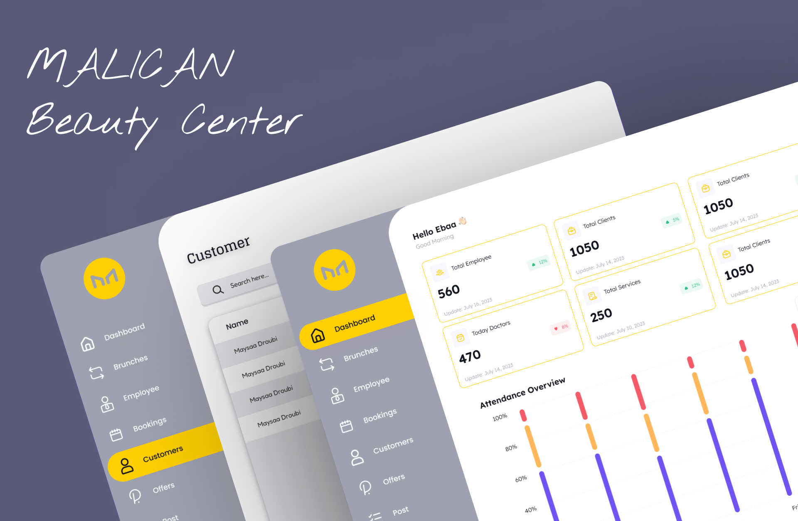

# :sparkles::sparkles: Manican Beauty Center
1. Appointment and Booking Management
Adding Clients: The responsible employee can add new clients to the system.
Appointment Management: Schedule appointments for clients for the desired services.
Booking Request Approval: Manage and follow up on booking requests from clients.
2. Employee Attendance Management
Monitoring Absences and Delays: Integrate the system with a fingerprint device to track employee attendance.
Attendance Reports: Generate detailed reports for each employee regarding their attendance.
Attendance Statistics: Monitor attendance statistics for each employee.
3. Statistics Monitoring
Branch Statistics: Monitor performance statistics for each branch separately.
4. Service Management
Adding Services: Allow supervisors to add new services with their details.
Available Time Slots: Define available time slots for each service.
5. Advertisement and Discounts Management
Adding Discounts: The responsible employee can add discounts and offers on services.
Scheduling Discounts: Set specific dates for discounts to attract clients.

# manican
Developers documentation contains setup processes and rules to work in the project.

### Generate Easy localization files:

```bash
dart run easy_localization:generate --source-dir ./assets/i18n/;dart run easy_localization:generate --source-dir ./assets/i18n -f keys -o locale_keys.g.dart
```

## Notice!!

* If this the first time you run the project make sure you get the `pubspec.yaml` dependency and sync the gradle project
* You do this through the following steps:

  1. turn on your vpn
  2. open android studio and run
     ```bash
     flutter pub get
     ```
  3. on your project and go to the file `/android/build.gradle`
  4. you notice that in the top right side there is a button said `Open for Editing in Android Studio`
  5. press on that button then select `New Window`
  6. wait until the gradle sync successfully (you can see the progress by open the `build` window in the bottom)

  ---
